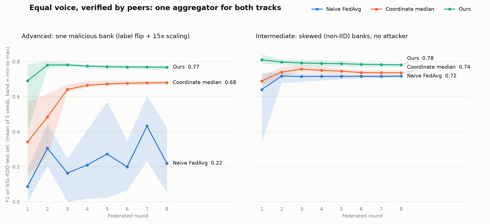

# ZeroTrustAI — Secure AI Hackathon, Day 2 & 3

**Equal Voice, Verified by Peers.** One aggregation function for federated intrusion detection on NSL-KDD. It fixes non-IID skew (Intermediate track) and detects and removes a poisoning bank (Advanced track, our primary).



| Track | Before (naive FedAvg) | After (ours) | Gain |
|---|---|---|---|
| Advanced, official attack, seed 42 (exported model) | 0.0511 | 0.7760 | +0.7249 |
| Advanced, official attack, mean of 5 seeds | 0.2194 | 0.7672 | +0.5478 |
| Intermediate, seed 42 | 0.7117 | 0.7821 | +0.0704 |
| Intermediate, mean of 5 seeds | 0.7169 | 0.7809 | +0.0641 |

Full explanation, stress tests and failure cases: [WRITEUP.md](WRITEUP.md).

## How it works

Each round the server:

1. divides each bank's update by its number of local SGD steps,
2. flags any bank whose normalised update is more than 5x the median length,
3. asks every bank to score every candidate model on a sample of its own private data, and quarantines a bank whose model ranks attacks worse than chance for the median voter,
4. averages the survivors with equal weights.

## Files

| File | What it is |
|---|---|
| `02_Intermediate_Advanced_Day2.ipynb` | The organisers' Day 2 notebook with both hooks filled in, fully run. Single source of truth for every number. |
| `model_scripted.pt` | Final exported model (TorchScript), Advanced track. Takes the standard 41-feature tensor. |
| `submission.json` | Self-reported metrics for that model. |
| `cover.png` | Cover chart, drawn by the notebook. |
| `data/` | NSL-KDD `KDDTrain+.txt` and `KDDTest+.txt`, identical to the files the notebook would download. |

## Reproduce

```
python3 -m venv .venv
.venv/bin/pip install torch scikit-learn pandas numpy matplotlib nbconvert ipykernel
.venv/bin/python -m nbconvert --to notebook --execute --inplace --ExecutePreprocessor.timeout=3600 02_Intermediate_Advanced_Day2.ipynb
```

About four minutes on CPU. This reruns every experiment over 5 seeds and rewrites `model_scripted.pt`, `submission.json` and `cover.png`. Built with torch 2.14, scikit-learn 1.9, pandas 3.0, numpy 2.5. On Kaggle or Colab, upload the notebook and run all cells; it downloads the data itself.

## What we changed in the starter notebook

1. One line in `run_fl`: it reseeds at the start of every run, so before/after comparisons share initial weights and batch order.
2. One function, `make_agg`, passed through the provided `agg_fn` hook for both tracks.

The model, local training, rounds, data split and attack code are untouched.

## Credit

Step-normalised equal weighting is FedNova (Wang et al., 2020). Teams Neuralynx and Zerooth published writeups using it before we finalised ours, and we adopted it after reading them. The peer check, the no-clipping result and the stress tests are ours.
